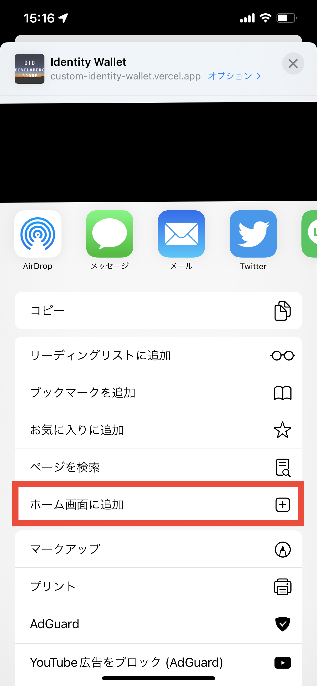
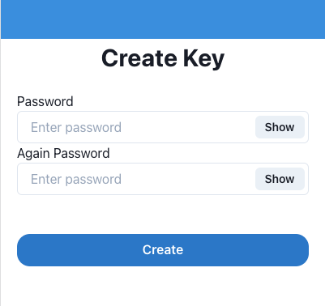
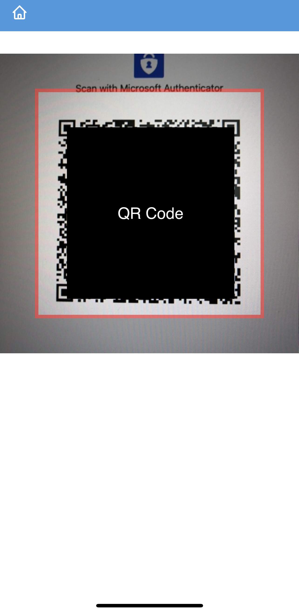
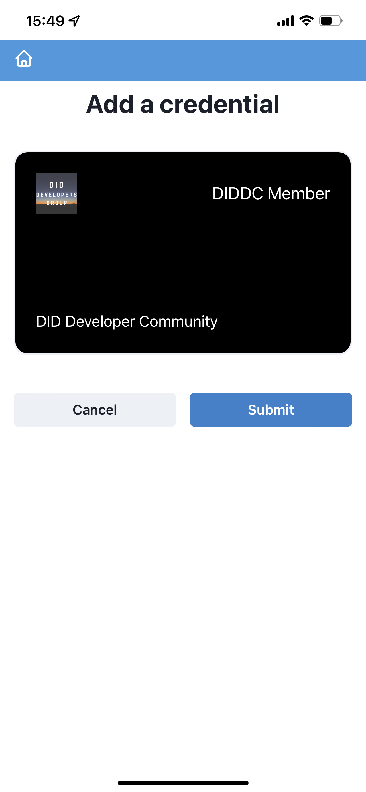
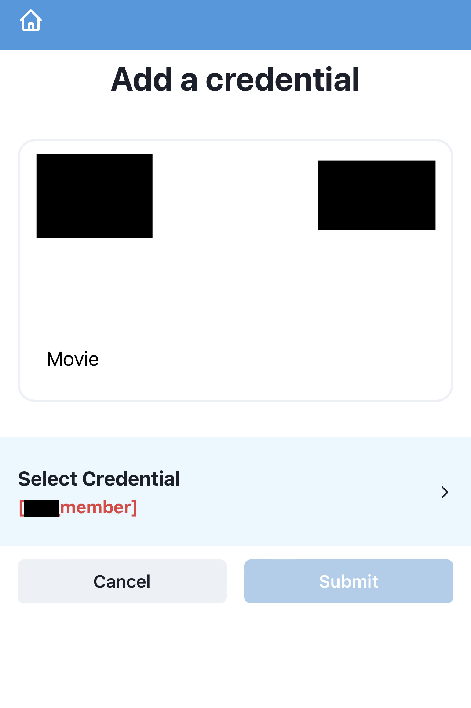
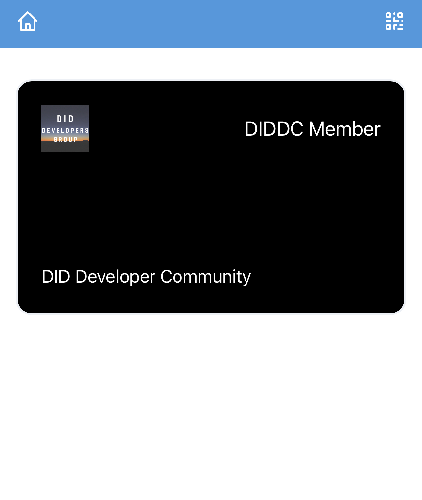
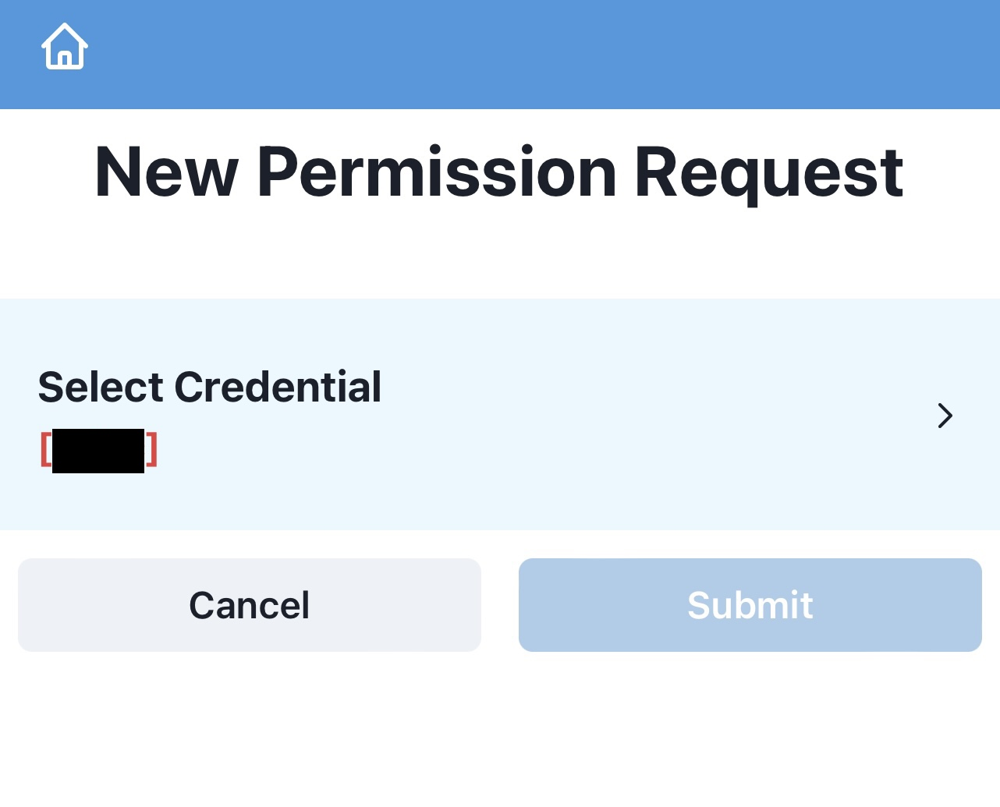

# Custom Identity Wallet

This is a very simple and plain white label Wallet SDK. As a customizable decentralized identity wallet, it can handle verifiable credentials.

## About

Certificates are a tool to express one's identity. The application can hold certificates and use cryptography to more securely issue and present certificates to verifiers.

This application used credentials following [Verifiable Credential](https://www.w3.org/TR/vc-data-model/) recommended by W3C.

### Background

- We want to create a customizable wallet that can be used as a template.
- We want to create a wallet with flexibility.

### Why we published

- Need a variety of feedback from people who have used the wallet app globally to improve the wallet app. We would also like to use this as a basis for a broad discussion of possible use cases for verifiable credentials.

### Specific example of wallets’ use case

- Customize wallet
  - Wallet allows customized credential image design.
  - Another customization is under consideration...
- When is customization necessary?
  - The ticket design that the ticketing service has been using up to now will be able to be used directly with the Wallet custom feature.
  - Conventional certificates can be brought in without changing the design.

## How to use

### Install

1. Follow this link on mobile.
   For iOS, use safari. For Android, use chrome.
   https://custom-identity-wallet.vercel.app/

2. Add wallet app
   For iOS
   Tap the share button →「Add to Home Screen」
   
   For Android
   Tap the three-dot overflow menu → 「Add to Home Screen.」
3. Open the wallet app and set a password.
   This password is used to encrypt the internally generated private key.
   **Private key recovery functionality has not yet been implemented**
   **If you forget your password, you will not be able to use your private key.** In that case, please delete the application from the home screen and add it again.
   

### Try it

#### Issue Credential

1. Tap the scanner icon on the right of the top bar
2. Read the QR code issued by the issuer
   It may take some time...
   
3. Submit and unlock your wallet(decrypt private key)
   
   (option)
   You may be asked to present a VC
   

4. "Success" is displayed and the vc is added to the home
   

#### Presentation Credential

1. Same as issue credential
2. Same as issue credential
3. Specify vc required for presentation
   
4. Submit and unlock your wallet(decrypt private key)
5. "Success" is displayed and Verifier can receive the credential
